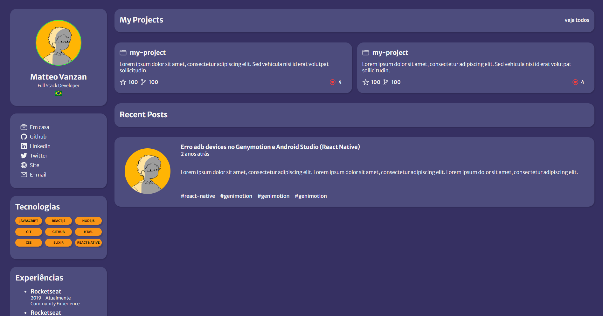

<h1 align="center"> PortifólioModel </h1>

Página feita a partir de um desafio da <a href="https://www.rocketseat.com.br">Rocketseat</a> com o objetivo de treinar as habilidades Front-end.

  <a href="#-tecnologias">Tecnologias</a>&nbsp;&nbsp;&nbsp;|&nbsp;&nbsp;&nbsp;
  <a href="#-projeto">Projeto</a>

  

## 🚀 Tecnologias

Esse projeto foi desenvolvido com as seguintes tecnologias:

- HTML e CSS
- Git e Github

## 💻 Projeto

O PortifolioModel foi uma página feita com objetivo de treinar os conhecimentos de Front-end através de um desafio da plataforma da <a href="https://www.rocketseat.com.br">Rocketseat</a> no começo dos meus estudos, pretendo ir aprimorando-o com o tempo até montar meu próprio portifólio do zero.

- [Acesse o projeto finalizado, online](https://matvzn.github.io/PortfolioModel/)
 

---
Feito por Matteo